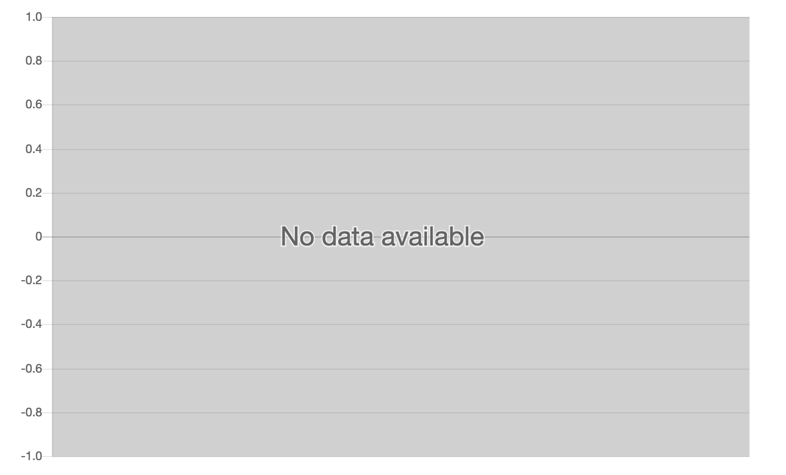

# Display Overlay on Empty Charts

[](https://npmjs.com/package/chartjs-plugin-empty-overlay) [](https://travis-ci.org/NeverBounce/chartjs-plugin-empty-overlay) [](https://codeclimate.com/github/NeverBounce/chartjs-plugin-empty-overlay)

[Chart.js](http://www.chartjs.org/) plugin to display a message when the chart has no data or all values in the datasets are zero.

Requires [Chart.js](/chartjs/Chart.js/releases) **2.1.5** or later.



## Usage

You can download the latest version of [chartjs-plugin-empty-overlay on GitHub](https://github.com/NeverBounce/chartjs-plugin-empty-overlay/releases/latest)

>This plugin has only been tested with line charts, if it doesn't work for your chart type please submit a PR or create an issue.

## Configuration

To configure this plugin, you can simply add the following entries to your chart options:

| Name | Type | Default | Description |
| ---- | ---- | ------- | ----------- |
| `emptyOverlay.enabled` | `Boolean` | `true` | `true` to enable this plugin, else `false` to disable it for the associated chart.
| `emptyOverlay.message` | `String` | `No data available` | The message to display when the chart is empty.
| `emptyOverlay.fillStyle` | `String` | `rgba(100,100,100,0.3)` | The color used for the background overlay.
| `emptyOverlay.fontColor` | `String` | `rgba(100,100,100,1.0)` | The color of the text fill.
| `emptyOverlay.fontStroke` | `String` | `rgba(255,255,255,0.6)` | The color of the stroke around the fill.
| `emptyOverlay.fontStrokeWidth` | `Number/String` | `3` | The line or stroke width around the text.
| `emptyOverlay.fontSize` | `Number/String` | `auto` | The size of the text displayed when the chart is empty. `auto` is recommended when your chart is responsive. If the chart has fixed dimensions you can specify a number in pixels (without unit).

For example:

```
{
    emptyOverlay: {           // enabled by default
        fillStyle: 'rgba(255,0,0,0.4)',     // Change the color of the overlay to red with a 40% alpha
        fontColor: 'rgba(255,255,255,1.0)',   // Change the text color to white
        fontStrokeWidth: 0        // Hide the stroke around the text
    }
}
```

## Development

You first need to install node dependencies (requires [Node.js](https://nodejs.org/)):

```shell
> npm install
```

The following commands will then be available from the repository root:

```shell
> gulp build            // build dist files
> gulp build --watch    // build and watch for changes
> gulp lint             // perform code linting
> gulp package          // create an archive with dist files and samples
```

## License

chartjs-plugin-empty-overlay is available under the [MIT license](LICENSE.md).
